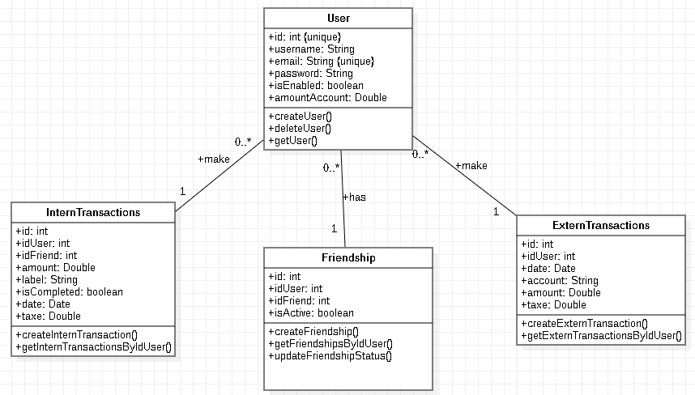

# PayMyBuddy

PayMyBuddy is a web application designed to simplify money transfers between friends. With PayMyBuddy, you will be able
to manage your transactions quickly, easily, and securely.

## Technologies Used

This project is built using Spring, Spring Security, Maven, Jakarta EE with Jakarta imports, Spring Data JPA, Spring
MVC.

## Installation

1. Set the database with the create.sql file in pay-my-buddy/resources or with the dataset.sql if you need a dataset as
   follows :

   | username | email           | password       |
      |----------|-----------------|----------------|
   | essai1   | essai1@mail.com | essai1password |
   | essai2   | essai2@mail.com | essai2password |
   | essai3   | essai3@mail.com | essai3password |

2. Clone the git repository https://github.com/Sapotte/pay-my-buddy.git
3. Add a .env file with database's infos :
   DATABASE_URL=
   DATABASE_USER=
   DATABASE_PASSWORD=

## UML

## MLD

